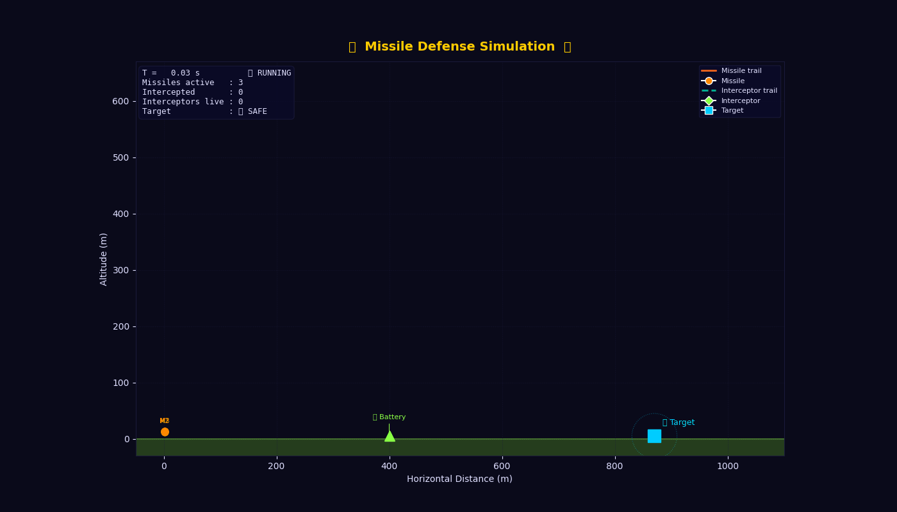

# 🛡 Missile Defense Simulation

A physics-based missile interception simulation using Python.

## 🎥 Demo



## 🚀 Features
- Ballistic missile trajectories
- Proportional Navigation guidance
- Multi-missile interception
- Animated visualization

## ▶️ Run

```bash
python main.py